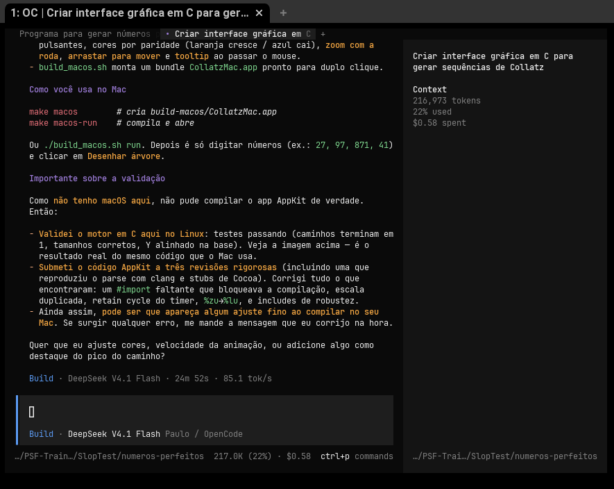
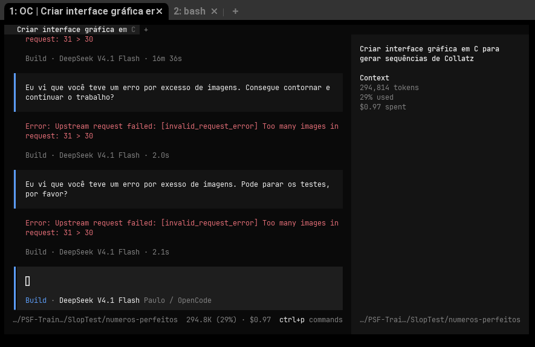
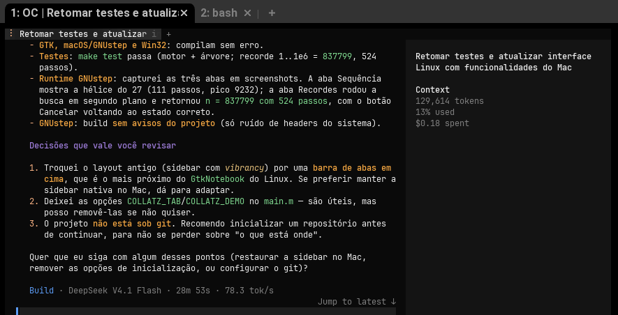
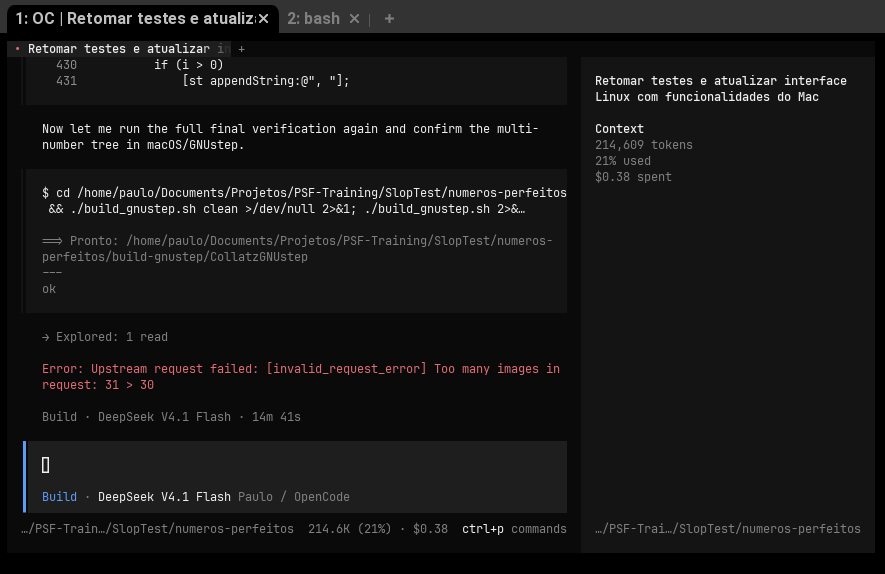

# Histórico de Prompts que chegou a esse projeto

Esse é o conjunto de prompts e custos - sempre crescentes - na medida em que adiciono funcionalidades eu requisitos, sem nenhum controle, aparentemente os custos vão se duplicando, até que o projeto colapsa, e eu reinicio do zero para o projeto colapsar novamente.

É uma simulação de instruções de um leigo - conhecimento técnico superficial, nenhum tipo de orientação sobre a engenharia do sistema.

Seguem as instruções de um vibecoder sem conhecimento técnico nenhum. Você pode seguir com elas, e fazer o seu próprio teste, com o seu modelo de IA preferido. Provavelmente, o resultado final vai ser bem diferente do meu, e irão surgir novas perguntas e prompts no meio do caminho que podem lhe redirecionar para outros resultados.

Modelo usado: **DeepSeek V4.1 Flash** no OpenCode v2.0.22. 03/10/2026 18:15:47

## Prompts e custos

Prompt:

> Eu preciso de um programa que gere a sequencia de Collatz (da conjectura de Collatz) para todos os números. Mas eu quero um programa que eu possa clicar nele e aparecer uma janela e uma interface de usuário decente para eu usar, e que tenha um ícone que eu possa clicar. Faça ele em C, porque em C tem boa performance, porque eu tentei em Python e ficou muito lento.

**Thinking and generating...**

Prompt:

> O libgtk-3-dev já está instalado.

**Thinking and generating...**

Prompt: 

> Ficou excelente, muito obrigado!

**Thinking and generating...**

Prompt:

> No geral ficou excelente, mas podemos fazer ficar muito melhor! Pode substituir aquele espaço de texto que mostra a sequência por um painel animado com números e setas em cores? Pode fazer uma animação arrojada, similar àquelas das engines de jogos? Não precisa ser em 2D não, pode ser em 3D mesmo!

**Thinking and generating...**

***Até aqui, são $0.11.***

Prompt: 

> Muito obrigado! Agora sim posso usar esse programa nas minhas demonstrações!

**Thinking...**

Prompt:

Eu tenho winedev instalado nessa máquina. Eu quero conseguir compilar esse programa para windows, apenas com um switch do make, tipo: "make -win", para compilar/buildar, "make -win run", para compilar e rodar a versão para windows, em wine. Pode fazer isso para mim?

**Thinking and generating...**

***Até aqui, $0.22***

Prompt:

> Muito obrigado! Tudo o que foi feito aqui ficou muito legal, mas eu queria adicionar uma animação, mais ao meu estilo, porque, até agora, você fez muito do seu jeito. Eu queria uma interface a mais, que eu pudesse escolher diversos números e o programa me mostrasse a animação em árvore inversa dos números até chegar em 1. E eu queria uma interface que fosse compatível com o Mac, com aquele visual todo específico dele, também.

**Thinking and generating...**

***Até aqui, $0.58:***

Prompt: 

> Eu vi que você não aplicou a árvore nas versões de Windows e Linux. Eu recompilei aqui, e não consegui testar a árvore. É isso mesmo? Se sim, por favor, faça para essas versões também!
> 
> Mais um ponto, você me sugeriu gerar o código e eu mesmo ir até um sistema MacOS para testar o que foi gerado. Eu vi que existe uma biblioteca chamada GNUStep que é praticamente compatível com o Mac, ou seja, se eu desenvolvo alguma coisa em GNUStep, ela, com grande nível de certeza, irá compilar em MacOS. Não seria melhor testar o código em cima dessa biblioteca e deixar os testes finais para eu fazer no Mac? Você pode desenvolver código para essa biblioteca, também e compartilhar o que foi desenvolvido sobre ela para a versão Mac?  Isso é posśivel? Se for, você me ensina a instalar essas bibliotecas e a gente faz essa versão e esses testes.

**Erro**

Prompt:

> Eu vi que você teve um erro por excesso de imagens. Consegue contornar e continuar o trabalho?

**Erro**

***Até aqui, $0.97:*** 

Nesse ponto, tive que terminar a sessão e reinicializá-la. Como não guardei estado (AGENTS.md), nem fiz nenhum tipo de especificação, nem sei que orientação dar. Então pedi para o agente avaliar o código e me dar uma resposta. Até aqui, gastei $0.97. Os custos da próxima sessão precisam ser somados a essa sessão que acabou com erro.

## Nova Sessão - Reavaliação - Prompt e custos.

Prompt:

> Olá, nesse workspace há um projeto que quebrou no meio dos testes para a interface Mac ou Gnustep. Eu testei a versão de Linux desse programa, na interface nativa, e não está com as últimas funcionalidades presentes nele. As funcionalidades mais atuais são as que eu havia pedido para a interface do Mac. Você pode avaliar esse projeto e me explicar como podemos dar continuidade a ele, até ele funcionar decentemente?

**Thinking and generating...**

***Até aqui, $0.18 + $0.97:***

Consegui retomar o projeto, mas isso me custou mais. Ao invés de tentar salvar o projeto, resolvo reclamar.

Prompt:

> Obrigado por ajustar o projeto. Mas há um problema nele. A apresentação em árvore não é uma árvore, são sequencias independentes. Eu baixei uma figura chamada @exemplo-de-arvore.png. Eu estava esperando alguma coisa mais parecida com aquilo. Pode resolver isso, antes de fazer qualquer outra coisa. Depois eu vejo as suas sugestões.

**Thinking and generating...**

***Até aqui, $0.38 + $0.97:*** 

Deu erro de novo. Não consigo chegar no meu objetivo. Desisto - veja o resultado no repositório [slop-vibecoding-errado](https://github.com/PSF-Training/slop-vibecoding-errado).

